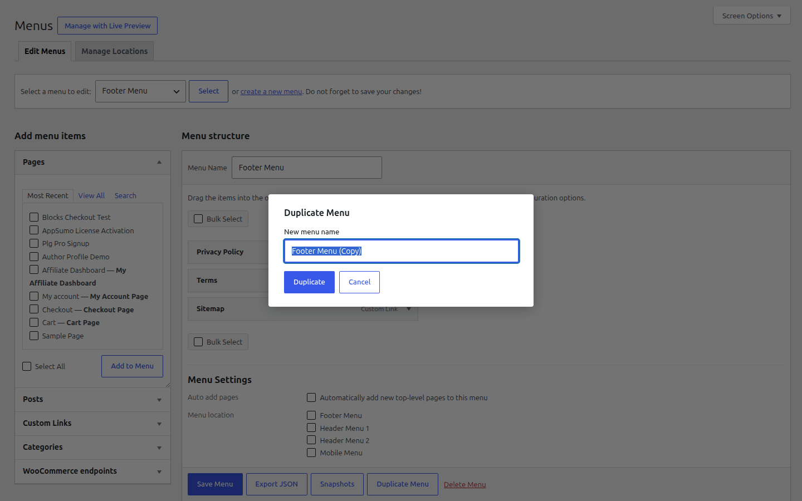
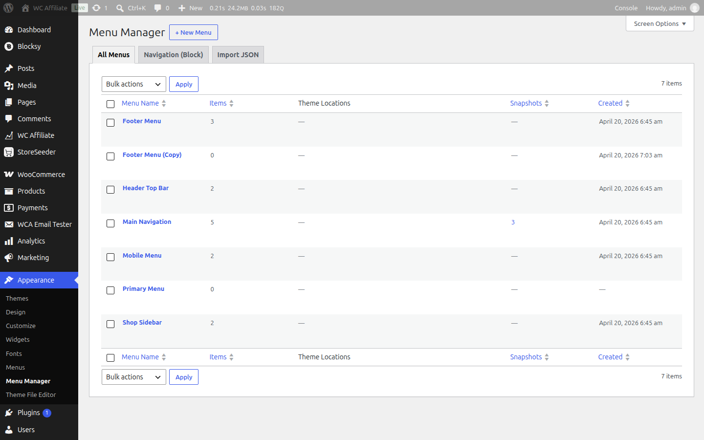
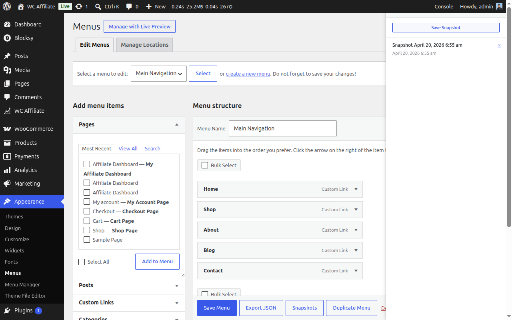
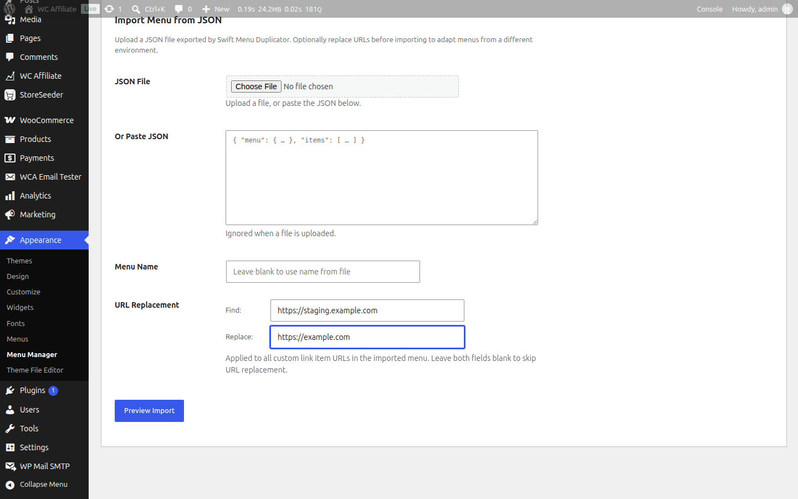
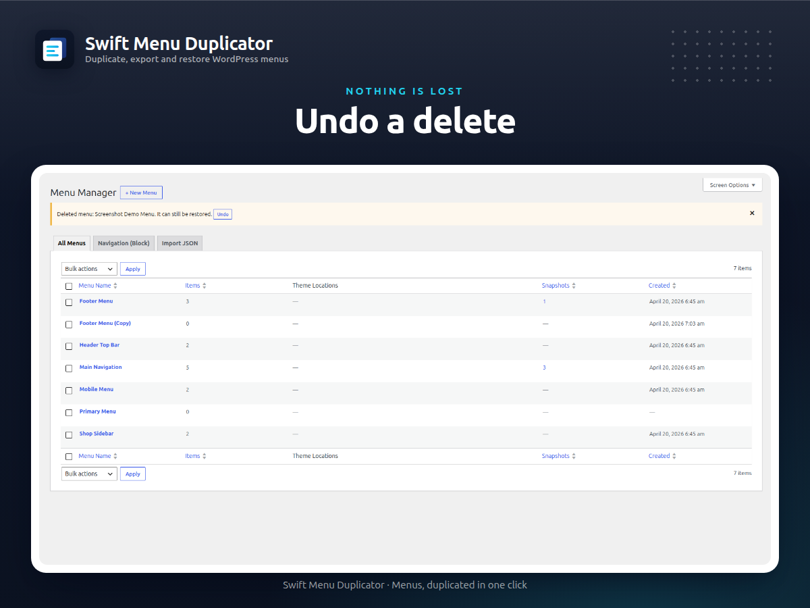
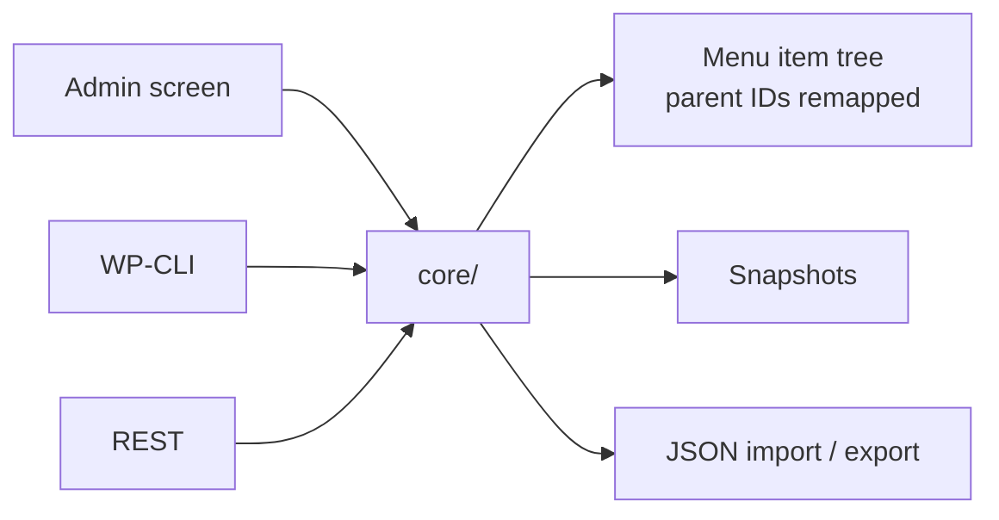

<div align="center">


# Swift Menu Duplicator

[](https://wordpress.org/plugins/swift-menu-duplicator/)
[](https://wordpress.org/plugins/swift-menu-duplicator/)
[](https://wordpress.org/plugins/swift-menu-duplicator/)
[](https://wordpress.org/plugins/swift-menu-duplicator/advanced/)
[](LICENSE)

Duplicate menus and their items, snapshot revisions, export and import as JSON, and drive all of it from WP-CLI or REST.

</div>



## Quick Start

Install from the WordPress admin — **Plugins → Add New**, search for "Swift Menu Duplicator", then **Install Now** and **Activate**.

To run it from source instead:

```bash
git clone https://github.com/mralaminahamed/swift-menu-duplicator.git
cd swift-menu-duplicator
composer install
yarn install
```

Minimum WordPress, PHP, and tested-up-to versions are shown in the badges above; `readme.txt` and the plugin header are the source of truth. Node.js 20+ is needed for development only.

## What It Does

WordPress has no way to copy a menu. Rebuilding one by hand is tedious and error-prone, and wanting the same structure on a second site leaves you clicking it out again.

This plugin adds the operations that are missing — duplicate, snapshot, restore, export, import, bulk-manage, and copy across a multisite network — and exposes every one of them through the admin, WP-CLI, and REST.

Classic `nav_menu` menus and block-theme `wp_navigation` posts are both supported, which matters because block themes do not store menus the way the Appearance → Menus screen does.

## Features

| Feature | Description |
|---------|-------------|
| Duplicate | Menus and their full item tree, with parent relationships remapped |
| Snapshots | Save a revision, restore it later; restoring snapshots the current state first |
| Undo | Deleting a menu can be undone, theme locations included |
| Export / import | JSON, with size and item-count limits that are filterable |
| Block themes | `wp_navigation` menus duplicated, exported and imported |
| Menu Manager | Slug, description and snapshot columns, sortable counts, bulk actions |
| Multisite | Copy a menu to another site on the network |
| WP-CLI | Every operation, plus `snapshot` and `navigation` subcommands |
| REST API | Routes under `swift-menu-duplicator/v1`, each publishing a schema |

## Screenshots

<details>
<summary>View all screenshots</summary>

### Duplicate



### Snapshots



### Export and import



### Settings



</details>

## Development

```bash
# PHP
composer test                # PHPUnit
composer test-f -- --filter SomeTest
composer lint                # WordPress coding standards
composer lint:fix            # Auto-fix
composer analyze             # phpcs + phpstan
composer lint:review         # Stricter directory-review ruleset
composer release             # Build and package

# JavaScript / CSS
yarn lint                    # JS + CSS
yarn lint:js:fix             # Auto-fix JS
yarn lint:css:fix            # Auto-fix CSS
yarn assets:shots            # WordPress.org screenshots
yarn assets:brand            # Icon and banners
```

> The PHPUnit configuration connects to MySQL as `root` with no password. On a machine set up differently the suite fails to bootstrap rather than reporting test failures — set the credentials in `phpunit.xml` first.

## Architecture



PHP lives under the PSR-4 namespace `SwiftMenuDuplicator\`:

```
swift-menu-duplicator.php    Bootstrap
includes/
  core/                      Duplication, snapshots, the item-tree walk
  import/                    JSON import and export
  admin/                     Admin screens, bulk actions, assets
  rest/                      REST routes (swift-menu-duplicator/v1)
  cli/                       WP-CLI commands
  compat/                    Third-party menu-plugin interoperability
  utils/                     Shared helpers
```

`core/` owns the operations outright — admin, REST and CLI are three ways of asking for the same work, which is why a menu duplicated from the command line is identical to one duplicated from the screen.

Menu items are a **tree**, not a list: children reference parents by ID, so duplication remaps every parent reference to the newly created item rather than copying rows verbatim. That remapping is the part to read first.

## Extensibility

```php
// Name the duplicated menu
add_filter( 'swift_menu_duplicator_new_menu_name', function( $name, $original ) {
    return $name;
}, 10, 2 );

// React after a menu is duplicated
add_action( 'swift_menu_duplicator_after_duplicate_menu', function( $new_id, $original_id ) {
    // custom logic
}, 10, 2 );

// Import limits
add_filter( 'swift_menu_duplicator_max_import_bytes', function( $bytes ) { return $bytes; } );
add_filter( 'swift_menu_duplicator_max_import_items', function( $items ) { return $items; } );

// How many snapshots to keep, and how long undo lasts
add_filter( 'swift_menu_duplicator_snapshot_limit', function( $limit ) { return $limit; } );
add_filter( 'swift_menu_duplicator_undo_ttl', function( $seconds ) { return $seconds; } );

// Who may use the REST routes
add_filter( 'swift_menu_duplicator_rest_permission', function( $allowed ) { return $allowed; } );
```

## Security

- Every REST route and WP-CLI command is capability-gated, and the gate is filterable through `swift_menu_duplicator_rest_permission`
- Admin actions are nonce-checked
- Imports are bounded by size and item-count limits before anything is written
- No analytics, telemetry, or phone-home

Report vulnerabilities privately — see the [security policy](SECURITY.md).

## Changelog

The complete version history lives in [CHANGELOG.md](CHANGELOG.md), in [Keep a Changelog](https://keepachangelog.com/en/1.1.0/) format. [`readme.txt`](readme.txt) carries only the most recent releases, and is rendered on the [WordPress.org changelog page](https://wordpress.org/plugins/swift-menu-duplicator/#developers).

## Contributing

Bug reports, feature requests, and pull requests are welcome. Read the [contributing guide](CONTRIBUTING.md) before opening a pull request, and file issues on the [issue tracker](https://github.com/mralaminahamed/swift-menu-duplicator/issues).

## Maintainer

Al Amin Ahamed — [alaminahamed.com](https://alaminahamed.com) · [@mralaminahamed](https://github.com/mralaminahamed)

## License

[GPL-2.0-or-later](LICENSE)
